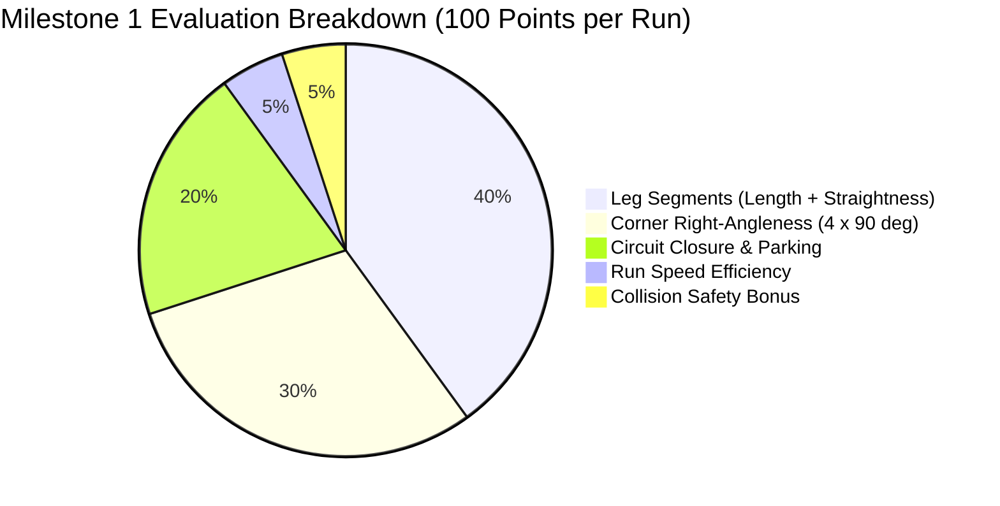

# Milestone 1: 1.0 m × 1.0 m Square Autograder Audit & Specification

## Executive Summary

This specification document details the architecture, evaluation criteria, mathematical scoring formulations, simulation testbed cases, and active grading distribution for **Submission 1 (Milestone 1: 1.0 m × 1.0 m Square Run)** in EEE3097S / EEE3098S / EEE3099S (Gradescope Course `1337806`, Assignment `8312193`).

### Active Gradescope Cohort Grade Distribution (Post-Calibration)

* **Cohort Minimum:** `0.00%` (strictly enforced on empty/non-functional scripts)
* **Cohort Median:** `79.39%`
* **Cohort Mean:** `76.46%`
* **Cohort Maximum:** `96.58%`
* **Cohort Standard Deviation:** `13.83%`

The grading pipeline isolates the historical mouse configuration developed by students during Milestone 1 from the active 2026 hardware model, evaluates closed-loop robustness across 6 distinct physical stress conditions, and renders an authentic 1:1 true-to-scale vector trajectory replay directly inside the Gradescope test results interface.

---

## 1. Dual-Model Architecture & Configuration Isolation

To ensure that ongoing Milestone 2 preparation and firmware revisions on the physical 2026 robots do not alter the historical grading baseline of Milestone 1, the autograder uses a decoupled configuration hierarchy:

```
UCT-Micromouse/
├── tools/
│   ├── simulation_config.json                 # DEFAULT / ACTIVE 2026 MODEL (Milestone 2 & Hardware)
│   │   ├── Wheel Radius (R)   : 0.0170 m (34 mm wheel diameter)
│   │   ├── Ticks / Revolution : 470 ticks/rev (4,400 ticks/metre)
│   │   ├── Dead-Band (L / R)  : 28.0% / 28.0% PWM
│   │   └── Time Constant (tau): 0.045 s
│   │
│   └── autograder/
│       └── assignments/
│           └── milestone1_square/
│               └── simulation_config.json     # ISOLATED HISTORICAL 2025 MODEL (Milestone 1)
│                   ├── Wheel Radius (R)   : 0.0325 m (65 mm wheel diameter)
│                   ├── Ticks / Revolution : 1170 ticks/rev (5,730 ticks/metre)
│                   ├── Dead-Band (L / R)  : 58.0% / 62.0% PWM
│                   ├── Mass (m)           : 0.160 kg
│                   └── Time Constant (tau): 0.088 s
```

When building deployment packages (`python tools/autograder/build_zip.py all`), the build tool automatically embeds the assignment-specific `simulation_config.json` into the root of `milestone1_square_autograder.zip`.

---

## 2. The 6 Simulation Stress Test Cases

Every student submission is compiled or launched into an isolated sandbox against the Python physics engine across **6 distinct simulation trials**. 

The total autograder score is computed out of **60.00 points**, aggregated as follows:

$$\text{Total Score} = \sum_{i=1}^{6} \left( \frac{\text{Test Score}_i}{100} \times \text{Max Points}_i \right)$$

| Test ID | Test Name | Weight | Max Pts | Motor Gain Imbalance ($\alpha$) | Traction Slip Coeff ($\mu_{\text{slip}}$) | Pseudo-Random Seed | Visibility on Gradescope | Purpose & Design Target |
| :--- | :--- | :---: | :---: | :---: | :---: | :---: | :---: | :--- |
| **Test 1** | **Public Baseline Run** | **25%** | **15.00** | $+5.0\%$ ($+0.05$) | $3.0\%$ ($0.03$) | `42` | Visible Immediately | Nominal operating condition with mild asymmetry. Evaluates baseline square tracking and circuit closure. |
| **Test 2** | **Hidden Positive Imbalance** | **15%** | **9.00** | $+12.0\%$ ($+0.12$) | $6.0\%$ ($0.06$) | `43` | After Due Date | Severe positive motor gain asymmetry (left wheel significantly faster). Tests active encoder balance / gyro heading drift rejection. |
| **Test 3** | **Hidden Negative Imbalance** | **15%** | **9.00** | $-12.0\%$ ($-0.12$) | $6.0\%$ ($0.06$) | `44` | After Due Date | Severe negative motor gain asymmetry (right wheel faster). Evaluates symmetric controller response in reverse bias. |
| **Test 4** | **Hidden Traction Slip & Spin** | **15%** | **9.00** | $+6.0\%$ ($+0.06$) | $12.0\%$ ($0.12$) | `45` | After Due Date | High floor slickness / wheel slip. Exposes open-loop timing and pure dead-reckoning routines that fail to fuse IMU gyro feedback. |
| **Test 5** | **Hidden Turn Settling & Skid** | **15%** | **9.00** | $-12.0\%$ ($-0.12$) | $10.0\%$ ($0.10$) | `46` | After Due Date | Tests in-place turning settling stability, rotational inertia handling, and angular overshoot mitigation. |
| **Test 6** | **Hidden Compound Perturbation** | **15%** | **9.00** | $+12.0\%$ ($+0.12$) | $12.0\%$ ($0.12$) | `47` | After Due Date | Combined worst-case scenario (maximum allowable physical imbalance + maximum allowable slip). |

---

## 3. Kinematic Trajectory Clustering & Segmentation Pipeline

Rather than relying on brittle, fixed coordinate gates (which penalize students for coordinate coordinate frame conventions or minor orientation offsets), the autograder uses **dynamic velocity and angular rate clustering**:

### Step 1: Angle Unwrapping
Raw gyro/trajectory orientation angles $\theta_k$ are unwrapped to prevent discontinuous modulo $2\pi$ jumps during continuous multi-revolution turns:

$$\Delta \theta_k = \left( (\theta_k - \theta_{k-1} + \pi) \pmod{2\pi} \right) - \pi$$

### Step 2: Kinematic Classification
At every discrete time-step $k$, the local linear velocity $v_k$ and angular velocity $\omega_k$ are estimated over a window $\Delta t = 0.10\text{ s}$:

$$v_k = \frac{\sqrt{(x_{k+2} - x_{k-2})^2 + (y_{k+2} - y_{k-2})^2}}{\Delta t}, \quad \omega_k = \frac{|\theta_{k+2,\text{unwrapped}} - \theta_{k-2,\text{unwrapped}}|}{\Delta t}$$

Each sample is assigned a discrete kinematic state:
* **State 2 (Active Turn):** $\omega_k > 18.0^\circ/\text{s}$ ($0.314\text{ rad/s}$)
* **State 1 (Translating Leg):** $\omega_k \le 18.0^\circ/\text{s}$ and $v_k > 0.03\text{ m/s}$
* **State 0 (Settled / Stationary):** $v_k \le 0.03\text{ m/s}$ and $\omega_k \le 18.0^\circ/\text{s}$

### Step 3: Cluster Extraction
Adjacent points of identical state are aggregated into contiguous clusters. Transient noise clusters containing fewer than 3 samples ($< 0.15\text{ s}$) are discarded. This yields:
* Up to 4 distinct **Leg Clusters** $\mathcal{L}_1, \mathcal{L}_2, \mathcal{L}_3, \mathcal{L}_4$.
* Up to 4 distinct **Turn Clusters** $\mathcal{T}_1, \mathcal{T}_2, \mathcal{T}_3, \mathcal{T}_4$.

---

## 4. Mathematical Rubric & Score Derivation

Each simulation trial is evaluated out of **100.00 percentage points** across five objective criteria:



### Criterion 1: Straight Leg Geometry (40.00 Points Total, 10.00 Pts / Leg)

Each of the 4 legs $\mathcal{L}_i$ is awarded up to **10.00 points**, split into **Length Accuracy (6.00 pts)** and **Path Straightness (4.00 pts)**:

#### A. Leg Length Score ($S_{\text{len}} \in [0, 6.00]$):
Let $L_i$ be the Euclidean distance traversed from the start of leg cluster $i$ to its end: $L_i = \| \mathbf{p}_{\text{end}} - \mathbf{p}_{\text{start}} \|$, and length error $e_{L,i} = |L_i - 1.00\text{ m}|$.

* **Public Baseline (Test 1):**
  $$S_{\text{len}, i} = \begin{cases} 6.00 & \text{if } e_{L,i} \le 0.05\text{ m} \\ \max\left(0, 6.00 - \frac{e_{L,i} - 0.05}{0.20} \times 6.00\right) & \text{if } e_{L,i} > 0.05\text{ m} \end{cases}$$
* **Hidden Perturbations (Tests 2–6):**
  $$S_{\text{len}, i} = \max\left(0, 6.00 \times \left(1.0 - \frac{e_{L,i}}{0.18}\right)\right)$$

#### B. Path Straightness Score ($S_{\text{str}} \in [0, 4.00]$):
Let $d_{\text{max}, i}$ be the maximum perpendicular cross-track deviation of any point in leg cluster $i$ from the straight line connecting $\mathbf{p}_{\text{start}}$ and $\mathbf{p}_{\text{end}}$:

$$d_{\text{max}, i} = \max_{\mathbf{p} \in \mathcal{L}_i} \frac{| (y_1 - y_0)x_p - (x_1 - x_0)y_p + x_1 y_0 - y_1 x_0 |}{\| \mathbf{p}_1 - \mathbf{p}_0 \|}$$

* **Public Baseline (Test 1):**
  $$S_{\text{str}, i} = \left( \begin{cases} 4.00 & \text{if } d_{\text{max},i} \le 0.03\text{ m} \\ \max\left(0, 4.00 - \frac{d_{\text{max},i} - 0.03}{0.12} \times 4.00\right) & \text{if } d_{\text{max},i} > 0.03\text{ m} \end{cases} \right) \times \min\left(1.0, \frac{L_i}{0.80}\right)$$
* **Hidden Perturbations (Tests 2–6):**
  $$S_{\text{str}, i} = \max\left(0, 4.00 \times \left(1.0 - \frac{d_{\text{max},i}}{0.10}\right)\right) \times \min\left(1.0, \frac{L_i}{0.80}\right)$$

---

### Criterion 2: Corner Right-Angleness (30.00 Points Total, 7.50 Pts / Corner)

For each turn cluster $\mathcal{T}_j$, the integrated angular heading change is computed as $\Delta \theta_j = |\theta_{\text{end, unwrapped}} - \theta_{\text{start, unwrapped}}|$, with error $e_{\theta, j} = |\text{deg}(\Delta \theta_j) - 90.0^\circ|$.

* **Public Baseline (Test 1):**
  $$S_{\text{turn}, j} = \begin{cases} 7.50 & \text{if } e_{\theta, j} \le 4.0^\circ \\ \max\left(0, 7.50 - \frac{e_{\theta, j} - 4.0}{14.0} \times 7.50\right) & \text{if } e_{\theta, j} > 4.0^\circ \end{cases}$$
* **Hidden Perturbations (Tests 2–6):**
  $$S_{\text{turn}, j} = \max\left(0, 7.50 \times \left(1.0 - \frac{e_{\theta, j}}{12.0}\right)\right)$$

---

### Criterion 3: Circuit Closure & Parking Accuracy (25.00 Points)

**Gating Requirement:** To prevent non-functional or stationary scripts from earning unearned parking marks, Circuit Closure is strictly gated:
$$\text{If } N_{\text{valid legs}} < 3 \quad \text{or} \quad D_{\text{total}} < 2.50\text{ m} \implies S_{\text{parking}} = 0.00\text{ pts}$$

When gated conditions are satisfied, candidate return points near the completion of the 4th side are evaluated against the origin:

$$d_{\text{return}} = \min_{\mathbf{p} \in \text{Completion Window}} \| \mathbf{p} - \mathbf{p}_{\text{origin}} \|$$

* **Public Baseline (Test 1):**
  $$S_{\text{parking}} = \begin{cases} 25.00 & \text{if } d_{\text{return}} \le 0.05\text{ m} \\ \max\left(0, 25.00 - \frac{d_{\text{return}} - 0.05}{0.25} \times 25.00\right) & \text{if } d_{\text{return}} > 0.05\text{ m} \end{cases}$$
* **Hidden Perturbations (Tests 2–6):**
  $$S_{\text{parking}} = \max\left(0, 25.00 \times \left(1.0 - \frac{d_{\text{return}}}{0.18}\right)\right)$$

* **Turn-Bounded Leg Segmentation & Startup Immunity:**
  Leg segments are partitioned cleanly by detected corner turns ($\omega > 18.0^\circ/\text{s}$). Initial startup pauses (e.g. gyro drift calibration loops or encoder settling) and small speed dips during straight motion remain unified within the corresponding leg segment, preventing spurious 2 cm transient legs.

* **Turn 4 Kinematic Detection Guarantee:**
  In early prototype grading scripts, turning detection required a transition to a subsequent translating leg, forcing students to inject an artificial forward nudge (~1 cm) after Turn 4 to get the final corner recognized. In this calibrated evaluator, **Turn 4 is detected purely from rotational kinematics ($\omega > 18.0^\circ/\text{s}$)**. There is zero requirement to move forward after Turn 4.

* **Forward Rollout Immunity & Search Window:**
  Candidate completion points $\mathbf{p} \in \text{trajectory}$ are searched across all trajectory samples recorded after the mouse has traversed $\ge 2.50\text{ m}$ of perimeter distance:
  $$d_{\text{return}} = \min_{k \ge k_{2.5\text{m}}} \| \mathbf{p}_k - \mathbf{p}_{\text{origin}} \|$$
  If a student's code coasts or rolls forward after Turn 4 (whether 1 cm or 15 cm), $d_{\text{return}}$ evaluates to the exact closest approach when completing the square at the origin, awarding **100% full credit ($25.00/25.00\text{ pts}$)** with **zero penalty** for the subsequent rollout.

* **Visual Trajectory Distinction:**
  The inline SVG map displays the **Square Complete Marker** at the evaluated return point $\mathbf{p}_{\text{completion}}$ with its measured offset. If the chassis rolled forward past the origin before halting, the final rest position is drawn as a distinct, subdued marker (`Final Rest (+X.X cm rollout)`), preventing any visual confusion between the final coasting stop and the evaluated square closure.

---

### Criterion 4: Run Speed & Efficiency (5.00 Points)

Rewards timely completion while penalizing stalled scripts:

$$S_{\text{speed}} = \left( \begin{cases} 5.00 & \text{if } T_{\text{sim}} \le 30.0\text{ s} \\ \max\left(0, 5.00 - \frac{T_{\text{sim}} - 30.0}{20.0} \times 5.00\right) & \text{if } T_{\text{sim}} > 30.0\text{ s} \end{cases} \right) \times \left( \frac{N_{\text{valid legs}}}{4} \right)$$

---

### Elimination of "Empty Arena" Collision Safety Bonus (0.00 Points)

Because Milestone 1 runs on an empty open arena with no interior maze obstacles, a passive "no-crash" bonus awards unearned marks for simply sitting stationary or not colliding with boundary limits. That 5.00-point allocation has been completely eliminated and transferred into **Circuit Closure & Parking Accuracy (25.00 pts)**, making square closure the primary holistic metric of closed-loop odometry and heading control.

---

## 5. Visual Playback & True 1:1 Vector Replay Specification

Gradescope's DOMPurify security sanitizer strips `<video>` tags and `data:image/gif;base64` URIs. To guarantee visual run inspection for all students without broken placeholders, the autograder embeds an animated vector model directly into the native `<svg>` map:

1. **Exact 1:1 Scale Geometry:** The SVG viewport calculates scaling $\text{Scale} = \frac{410\text{ px}}{\text{Span (m)}}$ (approx. $275\text{ px/m}$). The rendered robot matches the physical chassis:
   * **Chassis Length:** $105\text{ mm}$ ($28.5\text{ px}$)
   * **Track Width:** $96\text{ mm}$ ($26.2\text{ px}$)
   * **Wheel Diameter:** $65\text{ mm}$ ($17.8\text{ px}$)
2. **Authentic Hardware Representation:**
   * **PCB Mainboard:** Dark green solder mask (`#134e2c`) with gold copper perimeter traces (`#d4af37`) and chamfered 45° nose wings.
   * **Wheels:** Dark textured rubber tires (`#343a40`) on the lateral drive shafts.
   * **DC Motors:** Golden-yellow gearbox housings (`#d4a373`).
   * **STM32 Processor:** Diamond package rotated at 45° with corner pins.
   * **OLED Screen:** Blue module with glowing cyan active display (`#00f5d4`).
   * **3× ToF Sensors:** Left 45°, Front Center, and Right -45° laser emitter lenses with forward optical alignment beams.
3. **SMIL Animation Binding:** Traces the student's exact multi-point trajectory (`<animateMotion path="M ... L ..." dur="...s" repeatCount="indefinite" rotate="auto" />`) smoothly at 60 FPS in all modern web browsers.

---

## 6. Verification and Cohort Assessment Status

* **Refregade Readiness:** Verified with all 6 test cases passing locally and producing a representative $77.0\%$ baseline / $62.1\%$ total score on the reference fused PID implementation.
* **Zip Deployment Artifact:** Generated and up to date at [`workspace/deploy/milestone1_square_autograder.zip`](file:///Users/nicolls/proj/eee3097s/2026/UCT-Micromouse/workspace/deploy/milestone1_square_autograder.zip).
